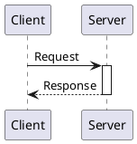
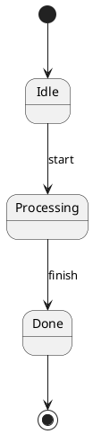
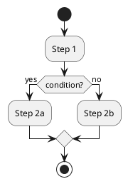
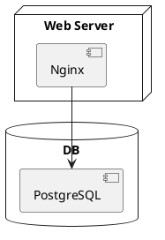

# @markdown-viewer/draw-uml

Convert [PlantUML](https://plantuml.com/) text diagrams into [DrawIO](https://www.drawio.com/) XML, then render to SVG with [`@markdown-viewer/drawio2svg`](https://github.com/markdown-viewer/drawio2svg).

Supported diagram types: **Class**, **Sequence**, **Activity**, **State**, **Use-case**, **Deployment**, **Object / Map**.

## Install

```bash
fibjs --install @markdown-viewer/draw-uml
```

> Requires [fibjs](https://fibjs.org/) >= 0.38.0.

## Quick Start

```javascript
import { textToDrawioXml } from '@markdown-viewer/draw-uml';
import { convert } from '@markdown-viewer/drawio2svg';

const puml = `@startuml
class Animal {
  +name: string
  +makeSound(): void
}
class Dog {
  +breed: string
}
Dog --|> Animal
@enduml`;

const xml = await textToDrawioXml(puml);   // PlantUML → DrawIO XML
const svg = convert(xml);                   // DrawIO XML → SVG
```

### Options

```javascript
const xml = await textToDrawioXml(dsl, {
  engine: 'dot',   // 'elk' (default) or 'dot'
  theme: { mode: 'dark', fontSize: 14, fontFamily: 'Arial' },
});
```

The engine can also be set per-diagram via `!pragma layout elk` or `!pragma layout vizjs`.

`theme.mode` supports `'light'` and `'dark'`. The dark preset changes node, line, note, and text colors, but does not inject a full-canvas background into the SVG.

## Architecture

```
PlantUML text
     │
     ▼
 ┌─────────┐     PEG parser (peggy)
 │ parsers/ │───▶ SemanticModel { nodes, edges, groups }
 └─────────┘
     │
     ▼
 ┌─────────┐     ELK (elkjs) or DOT (viz.js/WASM)
 │ layout/  │───▶ LayoutResult { positioned boxes & edges }
 └─────────┘
     │
     ▼
 ┌───────────┐
 │ generator/ │──▶ DrawIO XML string
 └───────────┘
     │
     ▼
 drawio2svg ──▶ SVG
```

### Pipeline

```
dispatch(dsl)           → { diagramType, body, parsed }
preprocess(body)        → { source, pragmas }
parseClassDiagram(...)  → SemanticModel
dotLayout / elkLayout   → { layout, renderers }
semanticToDrawioXml(..) → DrawIO XML string
convert(xml)            → SVG (via @markdown-viewer/drawio2svg)
```

## Project Structure

| Path | Purpose |
|------|---------|
| `src/index.ts` | Main entry point — `textToDrawioXml()` |
| `src/dispatcher.ts` | Diagram type detection (Sequence / Activity / Class / …) |
| `src/detect-context.ts` | Fine-grained diagram context detection |
| `src/parsers/` | PEG grammar parser (`puml-peggy.ts`) + per-type semantic builders |
| `src/model/` | Semantic model types (`SemanticModel`, `SemanticNode`, `SemanticEdge`, `SemanticGroup`) |
| `src/primitives/` | Renderer classes — measure, build DOT block, render mxCell XML |
| `src/layout/` | Layout engines (ELK, DOT/viz.js, orthogonal router, table layout) |
| `src/generator/` | DrawIO XML generators (`drawio-gen.ts`, `sequence-gen.ts`) |
| `src/shared/` | Utilities — Creole markup, color, XML, edge builder, theme, icons |

## Diagram Examples

All diagram types use the same `textToDrawioXml()` → `convert()` pipeline shown above.

**Sequence:**



**State:**



**Activity:**



**Deployment:**



## Layout Engines

| Engine | Description | Best for |
|--------|-------------|----------|
| **ELK** (default) | Modern layered algorithm via elkjs | Most diagrams |
| **DOT** | Graphviz via viz.js (WASM) | Complex hierarchies, fine-grained rank control |

Sequence diagrams always use a fixed grid layout regardless of the engine setting.

## Mxgraph Icons (Extended Syntax)

This project extends PlantUML with **5,000+ DrawIO mxgraph icons** from 40+ families — AWS, Azure, GCP, Cisco, BPMN, EIP, and more.

### Syntax

```
mxgraph.<family>.<icon_name> "Display Label" as <alias>
```

```plantuml
@startuml
mxgraph.aws4.lambda_function "Order Lambda" as lambda
mxgraph.aws4.generic_database "DynamoDB" as db
mxgraph.aws4.queue "SQS Queue" as sqs

lambda --> db : write
lambda --> sqs : enqueue
@enduml
```

Icons can be nested inside containers (`cloud`, `node`, `rectangle`, `database`, `package`, `frame`, …) and used as activity diagram action nodes.

### Styling

Append inline style after the alias to customize colors and line style:

```plantuml
mxgraph.aws4.lambda_function "Lambda" as fn #orange           ' fill color
mxgraph.aws4.lambda_function "Lambda" as fn ##red              ' stroke color only
mxgraph.aws4.lambda_function "Lambda" as fn #orange ##red      ' fill + stroke
mxgraph.aws4.queue "Queue" as q ##[dashed]green                ' dashed outline
mxgraph.aws4.lambda_function "Lambda" as fn #pink;line:red;line.bold;text:blue  ' fine-grained
```

| Syntax | Effect |
|--------|--------|
| `#color` | Fill color (name or hex) |
| `##color` | Stroke/line color only |
| `#fill ##stroke` | Fill + stroke |
| `##[dashed]color` | Dashed outline with color |
| `##[dotted]color` | Dotted outline with color |
| `##[bold]color` | Bold outline with color |
| `#back:color;line:color;text:color` | Fine-grained fill, line, and text color |

### Icon Families

**Cloud providers:**

| Family | Count | Description |
|--------|-------|-------------|
| `mxgraph.aws4` | 598 | AWS Architecture Icons (current) |
| `mxgraph.aws3` | 288 | AWS Architecture Icons (v3) |
| `mxgraph.azure` | 87 | Microsoft Azure |
| `mxgraph.mscae` | 148 | Microsoft Cloud & AI |
| `mxgraph.gcp2` | 111 | Google Cloud Platform |
| `mxgraph.alibaba_cloud` | 310 | Alibaba Cloud |

**Networking & infrastructure:**

| Family | Count | Description |
|--------|-------|-------------|
| `mxgraph.networks` | 57 | Network topology (router, switch, firewall, …) |
| `mxgraph.cisco` | 291 | Cisco network icons |
| `mxgraph.rack` | 289 | Server rack equipment |
| `mxgraph.veeam` / `veeam2` | 535 | Veeam infrastructure |
| `mxgraph.citrix` / `citrix2` | 223 | Citrix environment |
| `mxgraph.kubernetes` | 1 | Kubernetes |
| `mxgraph.openstack` | 18 | OpenStack |

**Modeling & process:**

| Family | Count | Description |
|--------|-------|-------------|
| `mxgraph.bpmn` | 6 | BPMN events, gateways, data objects |
| `mxgraph.archimate3` | 42 | ArchiMate 3.x |
| `mxgraph.eip` | 40 | Enterprise Integration Patterns |
| `mxgraph.sysml` | 21 | SysML |
| `mxgraph.dfd` | 6 | Data Flow Diagrams |
| `mxgraph.lean_mapping` | 35 | Lean / Value Stream Mapping |
| `mxgraph.flowchart` | 23 | Flowchart shapes |

**Other:** `mxgraph.electrical` (347), `mxgraph.office` (447), `mxgraph.salesforce` (96), `mxgraph.pid` (214), `mxgraph.webicons` (175), `mxgraph.floorplan` (61), and more.

Some families support **sub-variants** via dot-notation (e.g. `mxgraph.bpmn.event.start`, `mxgraph.bpmn.gateway2.exclusive`).

## API Reference

### Main

| Export | Signature | Description |
|--------|-----------|-------------|
| `textToDrawioXml` | `(dsl: string, options?: ConvertOptions) => Promise<string>` | Convert PlantUML text to DrawIO XML |
| `parsePumlToJson` | `(dsl: string) => ParsedPlantUML` | Parse PlantUML to raw JSON AST |
| `dispatch` | `(dsl: string) => DispatchResult` | Detect diagram type and pre-parse |

### Theme

| Export | Signature | Description |
|--------|-----------|-------------|
| `createTheme` | `(config?: ThemeConfig) => Theme` | Create a theme with computed sizing |

### Render Warnings

| Export | Signature | Description |
|--------|-----------|-------------|
| `getRenderWarnings` | `() => RenderWarning[]` | Get warnings from the last render pass |
| `clearRenderWarnings` | `() => void` | Clear accumulated warnings |

### Parsers

| Export | Description |
|--------|-------------|
| `parsePlantUml` | Low-level PEG parser |
| `parseSequenceDiagram` | Build semantic model for sequence diagrams |
| `parseActivityDiagram` | Build semantic model for activity diagrams |

### Types

```typescript
type LayoutEngine = 'dot' | 'elk';

interface ConvertOptions {
  engine?: LayoutEngine;     // default: 'elk'
  theme?: ThemeConfig;
}

interface ThemeConfig {
  fontSize?: number;         // default: 12
  fontFamily?: string;
}
```

### Model Exports

`DiagramType`, `NodeType`, `EdgeType`, `SemanticModel`, `SemanticNode`, `SemanticEdge`, `SemanticGroup` — see `src/model/` for full definitions.

## Renderer Pattern

Each renderer in `src/primitives/` implements a unified interface:

1. **`measure()`** — returns `{ width, height }` for DOT/ELK node sizing
2. **`buildDotBlock(ctx, indent)`** — generates DOT `node` / `subgraph cluster` block
3. **`render(box)`** — receives layout coordinates, outputs DrawIO mxCell XML strings

## Development

```bash
# Type check
fibjs --check -p ../tsconfig.json

# Regenerate PEG parser (from repo root)
npm run gen:puml-parser

# Render all fixtures (from repo root)
fibjs scripts/render-fixtures.mjs --all

# Run tests (from repo root)
fibjs test/all.test.js
```

## License

LGPL-3.0-only
