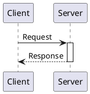
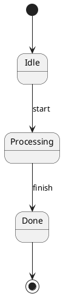
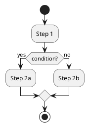
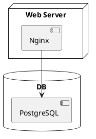

# @markdown-viewer/draw-uml

Convert [PlantUML](https://plantuml.com/) text diagrams into DrawIO XML, then render to SVG with `@markdown-viewer/drawio2svg`.

Supported diagram types: **Class**, **Sequence**, **Activity**, **State**, **Use-case**, **Deployment**, **Object / Map**.

## Install

```bash
fibjs --install @markdown-viewer/draw-uml
```

> Requires [fibjs](https://fibjs.org/) >= 0.38.0.

## Quick Start

```javascript
import { textToDrawioXml } from '@markdown-viewer/draw-uml';
import { convert } from '@markdown-viewer/drawio2svg';

const puml = `@startuml
class Animal {
  +name: string
  +makeSound(): void
}
class Dog {
  +breed: string
}
Dog --|> Animal
@enduml`;

const xml = await textToDrawioXml(puml);
const svg = convert(xml);
```

### Options

```javascript
const xml = await textToDrawioXml(dsl, {
  engine: 'dot',   // 'elk' (default) or 'dot'
  theme: { fontSize: 14, fontFamily: 'Arial' },
});
```

The engine can also be set per-diagram via `!pragma layout elk` or `!pragma layout vizjs`.

## Diagram Examples

All diagram types use the same `textToDrawioXml()` → `convert()` pipeline shown above.

**Sequence:**



**State:**



**Activity:**



**Deployment:**



## Layout Engines

| Engine | Description | Best for |
|--------|-------------|----------|
| **ELK** (default) | Modern layered algorithm via elkjs | Most diagrams |
| **DOT** | Graphviz via viz.js (WASM) | Complex hierarchies, fine-grained rank control |

Sequence diagrams always use a fixed grid layout regardless of the engine setting.

## Mxgraph Icons (Extended Syntax)

This project extends PlantUML with **5,000+ DrawIO mxgraph icons** from 40+ families — AWS, Azure, GCP, Cisco, BPMN, EIP, and more.

### Syntax

```
mxgraph.<family>.<icon_name> "Display Label" as <alias>
```

```plantuml
@startuml
mxgraph.aws4.lambda_function "Order Lambda" as lambda
mxgraph.aws4.generic_database "DynamoDB" as db
mxgraph.aws4.queue "SQS Queue" as sqs

lambda --> db : write
lambda --> sqs : enqueue
@enduml
```

Icons can be nested inside containers (`cloud`, `node`, `rectangle`, `database`, `package`, `frame`, …) and used as activity diagram action nodes.

### Styling

Append inline style after the alias to customize colors and line style:

```plantuml
mxgraph.aws4.lambda_function "Lambda" as fn #orange           ' fill color
mxgraph.aws4.lambda_function "Lambda" as fn ##red              ' stroke color only
mxgraph.aws4.lambda_function "Lambda" as fn #orange ##red      ' fill + stroke
mxgraph.aws4.queue "Queue" as q ##[dashed]green                ' dashed outline
mxgraph.aws4.lambda_function "Lambda" as fn #pink;line:red;line.bold;text:blue  ' fine-grained
```

| Syntax | Effect |
|--------|--------|
| `#color` | Fill color (name or hex) |
| `##color` | Stroke/line color only |
| `#fill ##stroke` | Fill + stroke |
| `##[dashed]color` | Dashed outline with color |
| `##[dotted]color` | Dotted outline with color |
| `##[bold]color` | Bold outline with color |
| `#back:color;line:color;text:color` | Fine-grained fill, line, and text color |

### Icon Families

**Cloud providers:**

| Family | Count | Description |
|--------|-------|-------------|
| `mxgraph.aws4` | 598 | AWS Architecture Icons (current) |
| `mxgraph.aws3` | 288 | AWS Architecture Icons (v3) |
| `mxgraph.azure` | 87 | Microsoft Azure |
| `mxgraph.mscae` | 148 | Microsoft Cloud & AI |
| `mxgraph.gcp2` | 111 | Google Cloud Platform |
| `mxgraph.alibaba_cloud` | 310 | Alibaba Cloud |

**Networking & infrastructure:**

| Family | Count | Description |
|--------|-------|-------------|
| `mxgraph.networks` | 57 | Network topology (router, switch, firewall, …) |
| `mxgraph.cisco` | 291 | Cisco network icons |
| `mxgraph.rack` | 289 | Server rack equipment |
| `mxgraph.veeam` / `veeam2` | 535 | Veeam infrastructure |
| `mxgraph.citrix` / `citrix2` | 223 | Citrix environment |
| `mxgraph.kubernetes` | 1 | Kubernetes |
| `mxgraph.openstack` | 18 | OpenStack |

**Modeling & process:**

| Family | Count | Description |
|--------|-------|-------------|
| `mxgraph.bpmn` | 6 | BPMN events, gateways, data objects |
| `mxgraph.archimate3` | 42 | ArchiMate 3.x |
| `mxgraph.eip` | 40 | Enterprise Integration Patterns |
| `mxgraph.sysml` | 21 | SysML |
| `mxgraph.dfd` | 6 | Data Flow Diagrams |
| `mxgraph.lean_mapping` | 35 | Lean / Value Stream Mapping |
| `mxgraph.flowchart` | 23 | Flowchart shapes |

**Other:** `mxgraph.electrical` (347), `mxgraph.office` (447), `mxgraph.salesforce` (96), `mxgraph.pid` (214), `mxgraph.webicons` (175), `mxgraph.floorplan` (61), and more.

Some families support **sub-variants** via dot-notation (e.g. `mxgraph.bpmn.event.start`, `mxgraph.bpmn.gateway2.exclusive`).

The full list of icon keys is in `docs/shape-defaults.json`.

## API Reference

| Export | Description |
|--------|-------------|
| `textToDrawioXml(dsl, options?)` | Convert PlantUML text to DrawIO XML string |
| `createTheme(config?)` | Create a theme with computed sizing from `fontSize` |
| `getRenderWarnings()` | Get warnings from the last render |
| `clearRenderWarnings()` | Clear accumulated warnings |

## License

See the repository root for license information.
